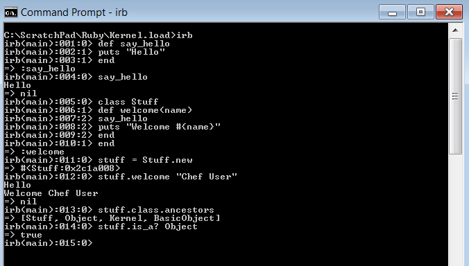
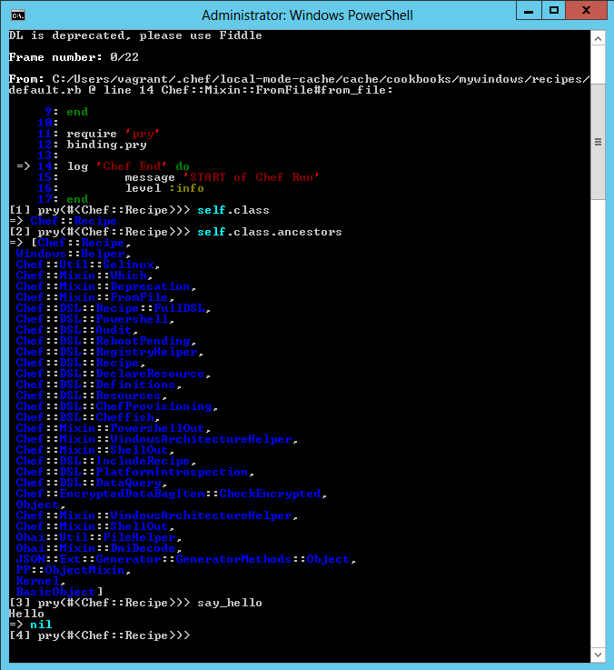

Library methods without namespaces
==================================

A method without a namespace in a library file can be called directly in Chef::Recipe and Chef::Resource classes, how is that possible?

Ruby methods without a namespace
--------------------------------

In Ruby if a method is defined without a namespace (not in a class or module) it is added to the Object class as a private method.

We can easily demonstrate this with some code in interactive Ruby (irb).

````
def say_hello
	puts 'Hello'
end

puts Object.private_methods.grep(/hello/) #=> => [:hello]

say_hello #=> 'Hello'
````

Any class based on the Object class will have access to our non namespaced methods (as they form part of the Object definition).

If we continuing on with the example above we can demonstrate this by creating our say_hello method and then defining a class, the say_hello method can be called within an instance of our class.

````
def say_hello
	puts 'Hello'
end

class Stuff
	def welcome(name)
		say_hello
		puts "Welcome #{name}"
	end
end

stuff = Stuff.new
stuff.welcome "Chef User" 
#=> Hello\n Welcome Chef User

stuff.class.ancestors 
#=> [Stuff, Object, Kernel, BasicObject]

stuff.is_a? Object 
#=> true
````



Library method inside Chef
--------------------------

When writing library code inside of Chef any methods that are not in a namespace get added to the Object class, all Chef classes inherit from the object class and this allows us to call non namespaced library methods directly from the Chef classes.

````
def say_hello
	puts 'Hello'
end
````

Add a pry breakpoint in a Recipe, see what it inherits and call our non namespaced method!



The beauty of this is that when your non namespace library code runs it will be in the context of a Chef class meaning you have access to Chef's node object and runtime contexts.

How is the library code loaded into memory
------------------------------------------

During the compile phase the cookbook compiler will load all library files, it does this by using Rubys load method NOT require.

This information doesn't seem important now but will be later! 

Loading Code in Ruby
--------------------

The final example shows non namespaced methods being loaded dynamically into memory and then executed them from a custom class.

Create a Ruby file with a single method (name it module_to_load.rb)

````
def add_numbers(n1, n2)
	n1+n2
end
````

Create another file in the same folder with the code that will load our single method (name it load_stuff.rb)

````
file_to_load = File.expand_path('module_to_load.rb', __dir__)
Kernel.load(file_to_load)

module CompanyA
	class Software
		def installed?
			true
		end
		
		def one_plus_one
			add_numbers(1,1)
		end
	end
end

x = CompanyA::Software.new
puts "Tracking where our methods come from ..."

puts "The method :add_numbers is found in .... #{x.method(:add_numbers)}" 
#=> #<Method: CompanyA::Software(Object)#add_numbers>

puts "The owner of :add_numbers is .... #{x.method(:add_numbers).owner}" 
#=> Object

puts "The source location of :add_numbers is .... #{x.method(:add_numbers).source_location}" 
#=> ["C:/ScratchPad/Ruby/Kernel.load/module_to_load.rb", 1]

puts "The inheritance trail of the Software Class (instance) is .... #{x.class.ancestors}" 
#=> [CompanyA::Software, Object, Kernel, BasicObject]

puts "Object private instance methods #{Object.private_instance_methods}" 
#=> [:add_numbers, :initialize_copy ...]

puts "private methods contains :add_numbers #{Object.private_methods.grep(/add/)}" 
#=> [:add_numbers, :singleton_method_added]

puts "Methods just for CompanyA::Software #{CompanyA::Software.instance_methods - Object.instance_methods}" 
#=> [:installed?, :one_plus_one]
````

No tests here but I've supplied the code described above.